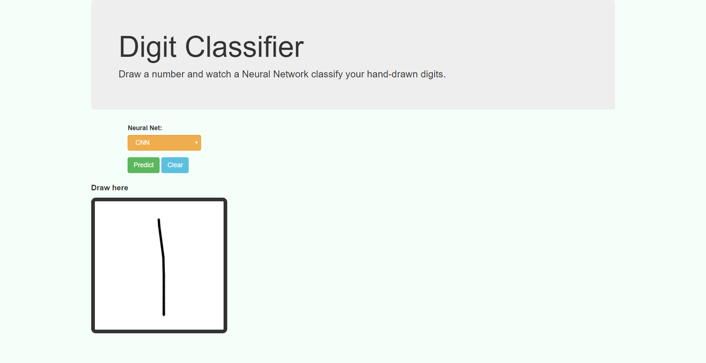
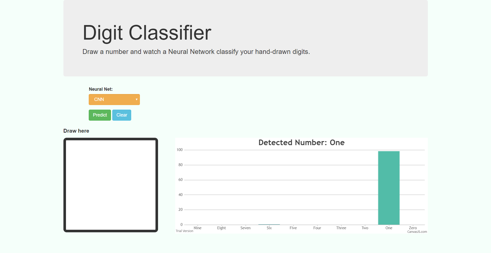
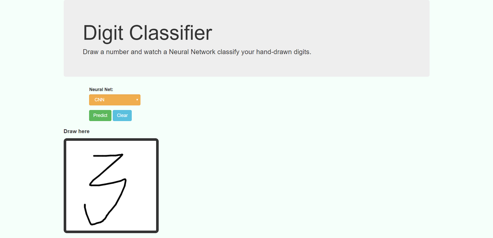
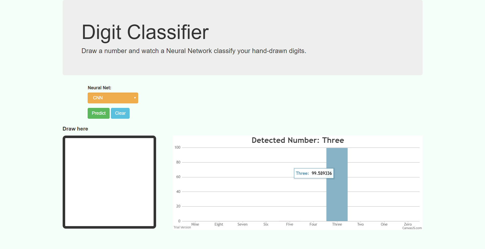

# Classifying Hand-drawn Digits using Flask
---------

* <b>Learning Resources</b>
  
    1. [CS231N Convolutional Neural Networks](http://cs231n.github.io/convolutional-networks/)
    2. [CS231N Visualizing what ConvNets learn](http://cs231n.github.io/understanding-cnn/)
    3. [A  Beginner's Guide To Understanding Convolutional Neural Networks](https://adeshpande3.github.io/adeshpande3.github.io/A-Beginner's-Guide-To-Understanding-Convolutional-Neural-Networks/)
    4. [Machine Learning is Fun! Part 3: Deep Learning and Convolutional Neural Networks](https://medium.com/@ageitgey/machine-learning-is-fun-part-3-deep-learning-and-convolutional-neural-networks-f40359318721)  
<br>

* Code Resources
  * [Convolutional Neural Network by Magnus Erik Hvass Pedersen](https://nbviewer.jupyter.org/github/Hvass-Labs/TensorFlow-Tutorials/blob/master/02_Convolutional_Neural_Network.ipynb)
  * [keras repositoy](https://github.com/keras-team/keras/blob/master/examples/mnist_cnn.py)
  * Deep Learning with Python - Francois Chollet
  <br>

* Model Training Files (2 different models trained)
  * (Basic) Initial -> [mnist-keras(colab)](https://colab.research.google.com/drive/1kJBrQ-jHNb9LLnbFKJAjp-MqZuGzbgor#forceEdit=true&offline=true&sandboxMode=true)
  * (Augmented) Used for predictions -> [Mnist-data-augmented(colab)](https://colab.research.google.com/drive/1UJjljA9TBmA_YNhfxe4wn_CwfVFYgaUK#forceEdit=true&offline=true&sandboxMode=true) 
  <br>

* Run Online
    * [repl.it](https://repl.it/@VaibhavSingh4/Classifying-hand-written-images)
<br>

* Inspired by
  * [Sourav Johar's Doodle Classifier](https://github.com/SouravJohar/doodle-classifier)   


#### Run Locally

1. Create a seperate python 3 environment.
<br>
2. Install the required packages
    ```python
    pip install -r requirements.txt
    ```

3. Run from environment
    ```python
    python server.py
    ```
##### Outputs
- Input
    
<br>

- Output
    

- Input
    
<br>

- Output
    


* TODO
    1. Remove scipy.misc.imresize deprecated warning.
        (remove this line to view the warning)
        ```python
        warnings.filterwarnings("ignore")
        ```
    2. Do instant detection of number.
    3. Create a better GUI.


